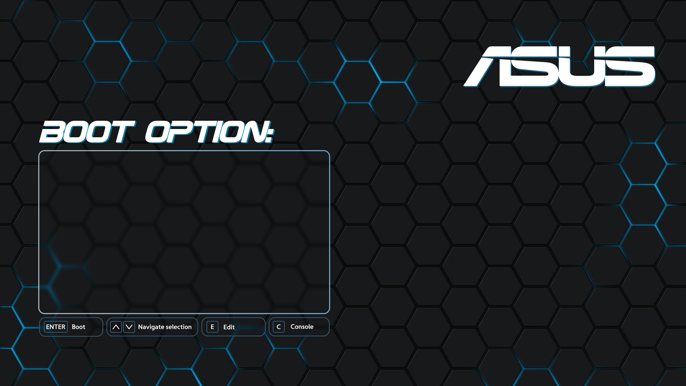
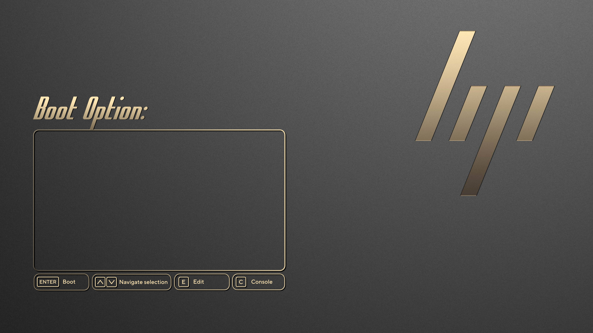
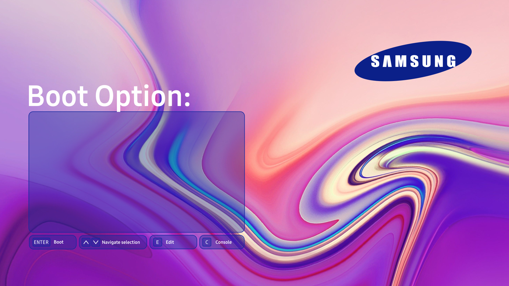
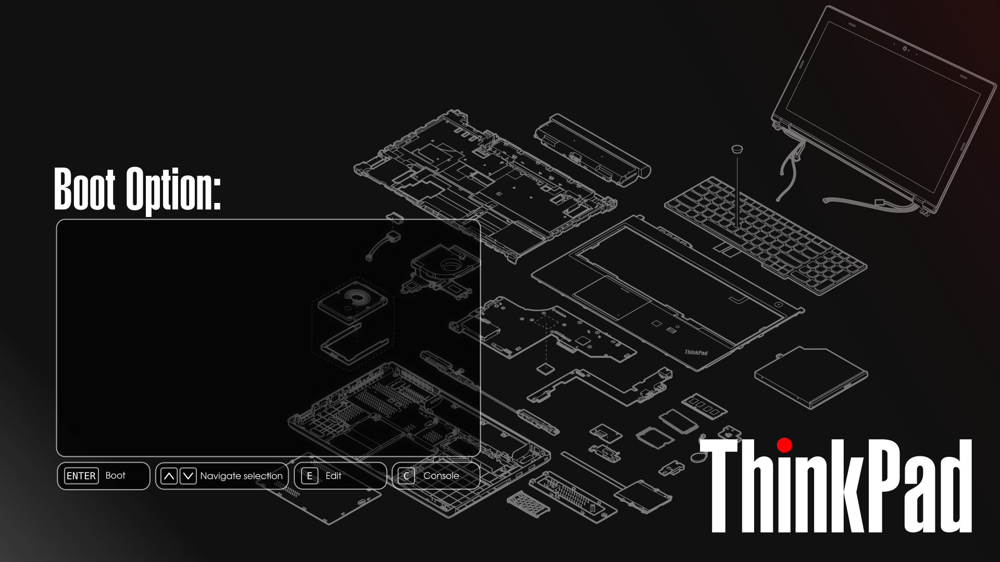
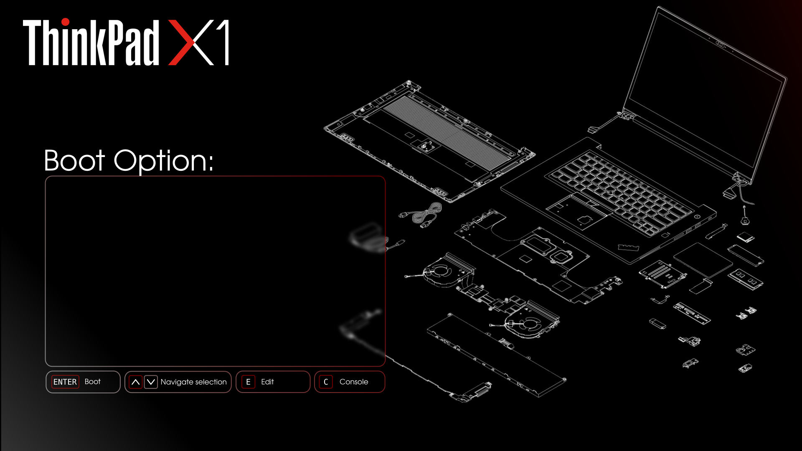
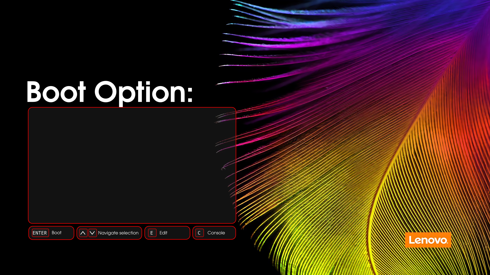
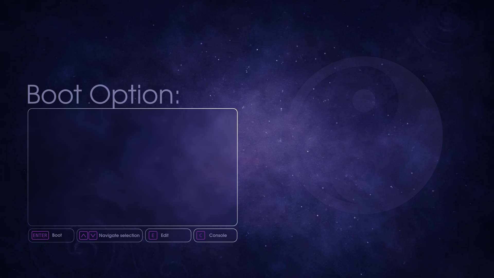

# Temas GRUB de marcas

## Introducción
Este proyecto es un GRUB personalizado inspirado en el tema [[Hyperfluent](https://github.com/Coopydood/HyperFluent-GRUB-Theme)] adaptado a fabricantes de computadoras/accesorios.

**Leer antes de Instalar:**

Para personalizar el tema se debe copiar el fondo, el selector y el archivo theme.txt (Y las fuentes de ser necesario) en la carpeta Theme.

```
Theme
|-background.png
|-select_c.png
|-theme.txt
```
Esta carpeta (`Theme`) contiene todos los archivos necesario para que el tema funcione

**Para la instalacion yo uso grub-customizer pero es opcional**

## Temas disponibles
Con los temas disponibles solo es necesario copiar los archivos de la carpeta a Theme.

- ASUS
- MSI
- HP
- Samsung
- Lenovo (Not yet)
    - ThinkPad
    - ThinkPadX1 Yoga
    - Yoga
- Default

## Plantilla
El la carpeta plantilla (Template) se encuentran los SVG base para el selector y la UI. Tambien dentro de cada carpeta de marca `{marca}/files` estan los archivos modificados. Pueden con esto editar o crear su propia marca.

# GRUB Brand Themes

## Introduction
This project is a customized GRUB inspired by the theme [[Hyperfluent](https://github.com/Coopydood/HyperFluent-GRUB-Theme)] adapted to computer/accessory manufacturers.

**Read Before Installing:**

To customize the theme, you must copy the background, the selector, and the `theme.txt` file (and fonts if necessary) into the Theme folder.

```
Theme
|-background.png
|-select_c.png
|-theme.txt
```

This folder (`Theme`) contains all the files necessary for the theme to work.

**For installation, I use grub-customizer, but it's optional**

## Available Themes
With the available themes, it is only necessary to copy the files from the folder into `Theme`.

- ASUS  
- MSI  
- HP  
- Samsung
- Lenovo (not yet)
    - ThinkPad
    - ThinkPadX1 Yoga
    - Yoga
- Default

## Template
In the `Template` folder, you will find the base SVGs for the selector and UI. Also, inside each brand folder `{brand}/files`, you will find the modified files. With these, you can edit or create your own brand.

# Preview
**MSI-GRUB**  


**ASUS-GRUB**  


**HP-GRUB**  


**Samsung-GRUB**


**ThinkPad-GRUB**  


**YogaX1-GRUB**  


**Yoga-GRUB**


**Intel-GRUB**  


**Default-GRUB**  



